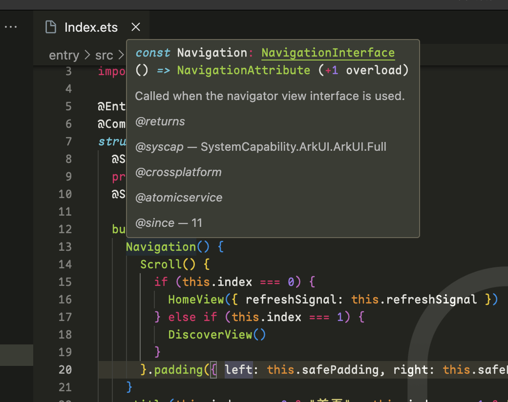
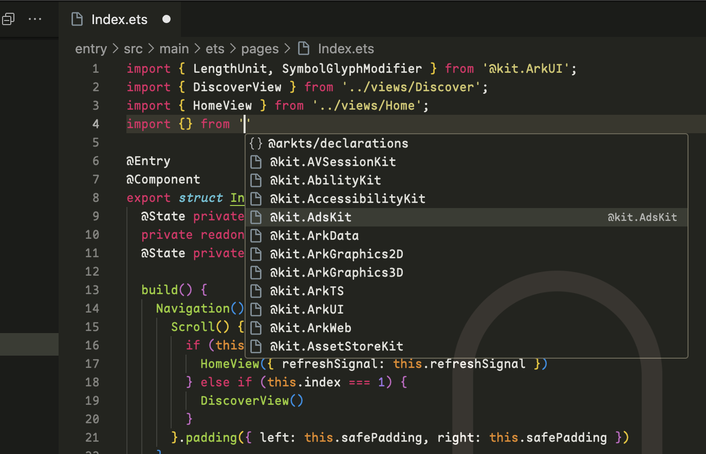
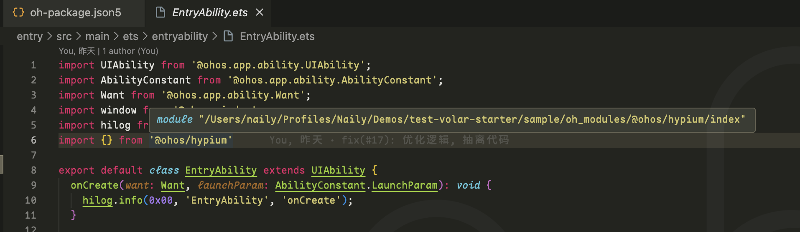
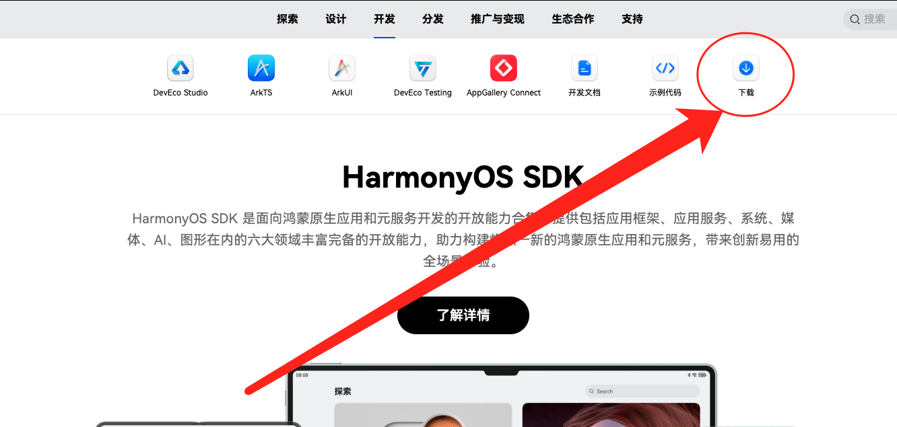
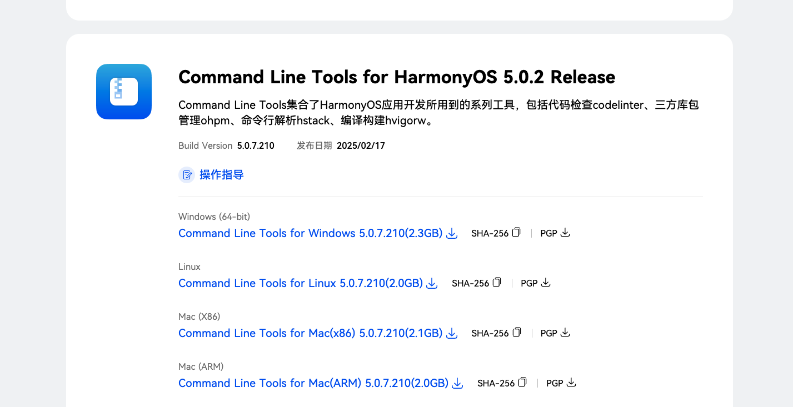
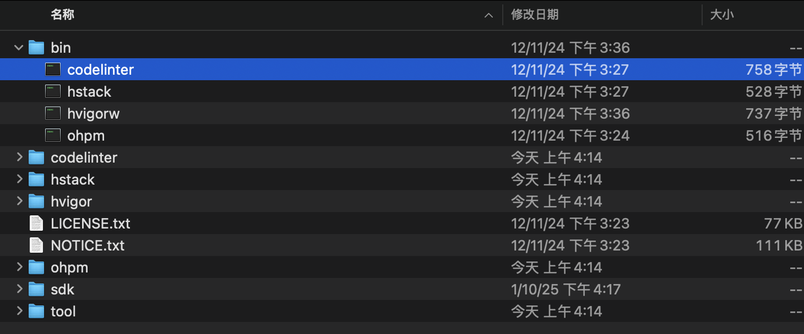

<div align="center">


# Naily's ArkTS Support

&nbsp;
[](https://marketplace.visualstudio.com/items?itemName=NailyZero.vscode-naily-ets)&nbsp;
[](https://www.npmjs.com/package/@arkts/declarations)&nbsp;
[](https://www.npmjs.com/package/@arkts/language-server)&nbsp;
&nbsp;
&nbsp;
&nbsp;

</div>

Language: <a href="./README.md">简体中文</a>｜English

> A QQ group has been created. Feel free to join for learning and discussion (Group ID: 746153004)

This is an ArkTS VSCode extension developed based on Volar. 🌹 It appears that there has been no proper support for ArkTS in VSCode until now. Most of the existing ArkTS extensions in the VSCode marketplace are very basic, so I decided to write one myself.

> ⚠️ Note: This package is currently based on the latest `API 13`. If your HarmonyOS version is lower than `API 13`, there might be some issues. PRs are welcomed.

- 🖊️ Comprehensive JSON Schema support. Supports the following JSON Schema files:
  - `build-profile.json5` Module-level/Project-level configuration
  - `oh-package.json5` Module-level/Project-level configuration
  - `module.json5` Module-level/Project-level configuration
  - `code-linter.json5` Module-level/Project-level configuration
  - All `color.json` files under `resources/element/` for kv value configuration
  - `main_pages.json5`
- 🪐 Thanks to the powerful Volar, since version 0.0.7, almost all syntax highlighting, autocompletion, and intelligent suggestions for ArkTS have been perfectly supported. 😋👍
- 📦 Automatically install `ohpm` dependencies and sync `hvigor` configuration when opening a project.
- 🚧 Supports inline `codelinter` prompts like ESLint, precisely locating problematic code. 👍
- 🀄️ Perfectly supports the import of third-party modules from `oh_modules` via `tsconfig.json` configuration. ⏬
- 🆓 `$r`, `$rawfile` completion and ArkTS code formatting are planned for future support. PRs are welcomed. 👀


## Extension Installation📦

Marketplace installation: https://marketplace.visualstudio.com/items?itemName=NailyZero.vscode-naily-ets

Or simply search for `ArkTS Support` in VSCode.

## ArkTS Source Code Navigation 🔍

ArkTS source code navigation requires `@arkts/declarations`, so you need to install it via `npm` in your HarmonyOS project.

```bash
npm install @arkts/declarations
```

Then, create a `tsconfig.json` file in the root directory of your HarmonyOS project, or modify the existing `tsconfig.json` file by adding the following:

```json5
{
  "extends": "@arkts/declarations/dist/tsconfig.base.json",
  "compilerOptions": {
    "types": ["@arkts/declarations"],
    "lib": ["ESNext"],
    "experimentalDecorators": true,

    // Basic compiler and module options, it is suggested the config as below
    "target": "ESNext",
    "module": "ESNext",
    "moduleResolution": "bundler",

    // It is suggested to turn on the strict mode
    "strict": true,
    // It is suggest to turn strictPropertyInitialization off
    "strictPropertyInitialization": false
  }
}
```

After inheriting this configuration, `Restart your VSCode` or `Save this file`. The ArkTS server will automatically reload the configuration (there will be a prompt in the bottom right corner).



When importing modules, corresponding prompts will also appear 😋 (provided your `tsconfig.json` is properly configured as described above).



## `oh_modules` Support 🀄️

Issue [#19](https://github.com/Groupguanfang/arkTS/issues/19) mentions a solution. Add the following configuration to your `tsconfig.json`:

```json5
{
  "compilerOptions": {
    "paths": {
      // Define the path of oh_modules, then you can import modules from oh_modules directly
      "*": ["./oh_modules/*"]
    }
  }
}
```

Now you can import modules from `oh_modules` directly:



## Code Linter 🚧

Support for code linter has been added since version 0.1.0 (essentially an ArkTS version of ESLint).

Check the [HarmonyOS SDK official website](https://developer.huawei.com/consumer/cn/develop/) to download the `Command Line Tools`.





After finish downloading, extract the downloaded file to a fixed location.



Copy the absolute path of the bin folder and configure it in the IDE settings.


After fixing the issue, the warning will disappear after a while:


## Star History 🌟

[](https://star-history.com/#Groupguanfang/arkTS&Date)

## Contact to Author 📧

- Telegram: [@GCZ_Zero](https://t.me/GCZ_Zero)
- X (Twitter): [@GCZ_Zero](https://x.com/GCZ_Zero)
- QQ: 1203970284，QQ Group Chat: 746153004
- WeChat: gcz-zero

### Coffee ☕️

If this project helps you, consider buying the author a coffee. ☕️

You can also join the QQ group for further discussions (Group ID: 746153004).

<div style="display: flex; gap: 5px;">


</div>

## License 📝

[MIT](./LICENSE)
